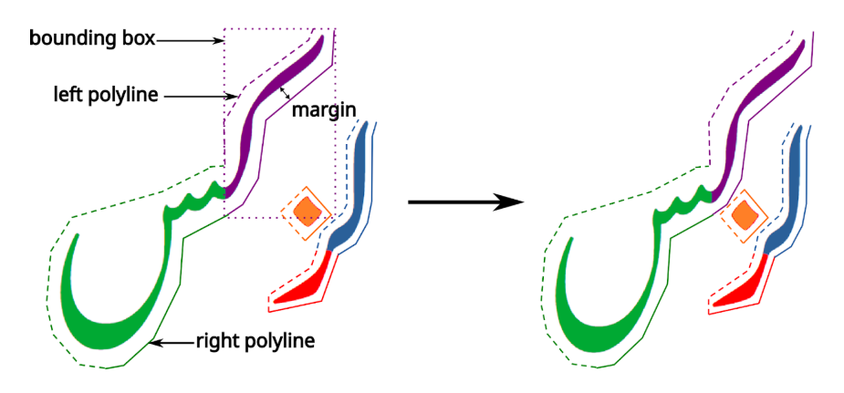

# PolyKern Lookup

M. Hosken, WSTech, SIL Global

# Introduction

This proposal presents a new lookup that implements a polyline outline based kern. The primary purpose for this lookup is to support kerning in situations of complex layout, in particular for Nastaliq Arabic fonts. There is already a tool that can create bubbles in Glyphs (BubbleKern) and then turn those into simple contextual lookups. But once the context becomes very complex, it is not feasible to create pure OpenType lookups to achieve what is necessary.

In creating a Nastaliq Arabic font, it is possible to produce an approximate horizontal kerning that allows for overlaps, etc. But it is very slow given the huge limitations of existing OpenType lookups.

# Description

The PolyKern lookup (GPOS lookup type 10\) is based around giving piecewise straight line boundaries (“polylines”) to the left and right of glyphs that need to be kerned. The goal of the algorithm is to shift the kernable glyphs such that their polylines abut the adjacent glyph without colliding. The process must also handle the fact that secondary glyphs may be attached to the base and their polylines must be taken into account. Particularly in Nastaliq, these secondary glyphs may include not only diacritics but also other bases that are attached cursively. Each glyph has two polylines, one on the left and the other on the right, to control the horizontal adjustment of the glyphs. The polylines are positioned in relation to the glyph outline so as to give the desired design margin between the closest point between two clusters. Each glyph's polylines are contained within a single bounding box, which differs from the bounding box of the glyph outline. The lookup adjusts the spacing between the two clusters in order that the combined right polylines of the left glyphs just touch the combined left polylines of the right glyphs.



The simplest OpenType model does not have the concept of clusters. Glyphs are positioned and any relationship between them lost. In order to identify which glyphs are in a cluster we have to categorise them. The GDEF table categorises glyphs into marks and bases (with ligatures being a subtype of base). In addition we also need to identify glyphs that are marked as bases by GDEF but that are acting as part of the cluster, perhaps as the result of cursive attachment. We call these attached bases and they are part of the cluster. A cluster is defined as a sequence of glyphs starting with a base and running through all following marks and attached bases until the next base (or space). Note that bases are often attached in the opposite order, so care must be taken in identifying which glyph IDs are considered attached bases for this lookup.

Bases without outlines are considered to be spaces. A space glyph is kerned across but keeps its width. Thus a space glyph between two clusters is handled as if we were kerning the two clusters without the space and then the distance between them is increased by the width of the space. After calculating the adjustment needed to set the space between two clusters, how this is applied to the glyph positions is up to implementations. For example, the implementation might insert a spacing glyph, probably with negative extent, or it might reduce (or increase) the advance of the last glyph of the right cluster (in a right-to-left context).

It is not always the case that every glyph is to be kerned. For example, in Nastaliq, punctuation may need to be not kerned under a following word. Also having a coverage table of ‘involved’ glyphs keeps the lookup in the same model as other GPOS lookups where the GPOS table is skipped for all glyphs not in the coverage table.

Each polyline is made up of straight line components. For simplicity, at any y position within the bounding box of the polyline, there may only be one point that is on the polyline. That is, a polyline may not have a vertical cup shape. In effect, it is convex in the x direction.

## Structure

The PolyKern lookup format is designed for in-memory processing. That is, the shaping engine does not need to create its own internal data structure from the lookup table and can access the table directly for what it needs.

_PolyPosFormat1 subtable_

| Type | Name | Description |
| :--- | :--- | :---------- |
| uint16 | format | Format identifier ― format \= 1 |
| Offset16 | baseCoverageOffset | Offset to a coverage table of all non-space base glyphs to consider |
| Offset16 | baseAttachedCoverageOffset | Offset to a coverage table of all base glyphs to be treated as attached bases. |
| Offset16 | boundariesArrayOffset | Offset to an array of boundaries for all glyphs in the font |

The `boundariesArray` contains a list of offsets to a boundary structure for each glyph. Offsets are relative to the start of the `boundariesArray`. Thus an offset of 0 may be used as a sentinel value. A value of 0 indicates that this glyph has no boundary information, which either means it is a base that is not in the main coverage table, or it is a space glyph or it is an ignored mark. Since this is a mapping between glyph and boundary, two different glyphs may share the same boundary.

_boundariesArray_

| Type | Name | Description |
| :--- | :--- | :---------- |
| Offset32 | boundary\[numGlyphs\] | Offset to a boundary structure for each glyph. numGlyphs comes from the maxp font table. |

The `boundary` structure contains 3 elements: a bounding box for the kerning polylines, such that all the points in `leftPoints` and `rightPoints` must lie within this bounding box, and two lists of points, one for each side of the glyph. The points in each list form a continuous polyline of straight lines. The two polylines are listed in sequence. The first is the left polyline and is described from the lowest y point in either polyline up to the highest y-point in any polyline. The y-value of a subsequent point in the line may not be less than the previous point. The second polyline immediately follows the left polyline and is the right polyline. It starts from the highest y-point (which is the same as the y-value of the last point in the left polyline, and proceeds downwards to the last point which has the same y-value as the first point in the left polyline. No point in the right polyline may have a y-value greater than the previous point. The result is a single outline describing the protected kerning area around the glyph. The whole outline is described within a bounding box which is also listed to speed up the lookup.

In some cases glyphs will never occur requiring a left or a right polyline. For simplicity of implementation in case the situation where such a polyline is required should occur, both polylines must exist, but nothing says both polylines need to reflect the glyph. A polyline may be a single line with a top and a bottom that goes straight through the glyph. 

_boundary_

| Type | Name | Description |
| :--- | :--- | :---------- |
| uint8 | numLeftPoints | Number of points in the left side polyline |
| uint8 | numRightPoints | Number of points in the right side polyline |
| uint16 | reserved |  |
| Point | minPoint | Bottom left of polyline bounding box |
| Point | maxPoint | Top right of polyline bounding box |
| Point | leftPoints\[numLeftPoints\] | Points in the left boundary polyline from bottom to top |
| Point | rightPoints\[numRightPoints\] | Points in the right boundary polyline from top to bottom |

A `point` is a simple x/y pair in font units, taking a total of 32 bits.

_point_

| Type | Name | Description |
| :--- | :--- | :---------- |
| FWORD | x | x position |
| FWORD | y | y position |

## Algorithm

Here we describe an algorithm for processing the PolyKern lookup. Other algorithms may be used so long as they give the same results. For the purposes of the algorithm, attached bases are treated as marks. Processing is done in surface order which contrasts from logical underlying order, but is direction independent. The algorithm calculates a shift value in the x-axis which may be negative to push overlapping glyphs apart. This value is initialised to a representation of infinity and the algorithm reduces this to the resulting shift. The represetation of infinity is an implementation detail. For example for an n-bit 2's complement integer it might be represented by 2^(n-1) - 1.

The algorithm calculates an extra separation caused by spaces between two clusters. If that extra separation is large enough, kerning my be unnecessary. The algorithm also tends to make the spacing between clusters uniform according to the polylines, this may require modifying if tracking is desired, for example.
```
1. Identify a non-space base glyph to be kerned in relation to a previous cluster. 
   Call this the right glyph.
2. Start with an initially infinite current shift and 0 extra shift
3. Scan backwards (in LTR) or forwards (in RTL) to find the next visible glyph
  3.1 If a glyph is invisible, add its width to the extra separation
  3.2 The first left glyph is the first visible glyph encountered
  3.3 Set the left glyph to the first left glyph

4. Compare their positioned bounding boundary boxes.
5. If they overlap in the y-axis (ignoring x-axis):
  5.1 Calculate the relative distance between the two glyphs
    5.1.1 The y relative distance is the right glyph's y position - left glyph's y position
    5.1.2 The x relative distance is the right glyph's x position - left glyph's x position - extra separation
  5.2 Calculate their required shift, given the current shift, the two glyphs
      and their relative distance in x & y.
  5.2 If their required shift is less than the current shift, update the current shift.
6. Set the left glyph to be the previous glyph to the left glyph (which is the next in RTL logical order)
7. If the new left glyph exists and is a baseAttach or mark:
  7.1. Goto 4.
8. Set the right glyph as the next glyph after the right glyph (which is previous in RTL logical order)
9. If the new right glyph exists and is a baseAttach or mark:
  9.1. Set the left glyph to the first left glyph
  9.2. Goto 4.
10. If processing left to right and the shift is not infinite:
  10.1 Subtract the current shift from the advance of the first base before the initially identified glyph.
11. Else if processing right to left and the shift is not infinite:
  11.1 Subtract the current shift from the advance of the initially identified (right) glyph.
```

There is a sub-algorithm needed to calculate the minimum separation of two glyphs given the current maximum separation and current required space. The _relative distance_ between the two glyphs is the signed difference between their positioned origins. We process from top to bottom

```
1. If the distance between the bounding boundary boxes in x is greater than the current shift, 
   return the current shift.
2. Start with the first right boundary point of the left glyph calling it the left point.
3. Start with the last left boundary point of the right glyph calling it the right point.
4. Set y to the minimum y of the two points.

5. While y <= the right point's y:
  5.1. Set the right point to the previous left boundary point on the right glyph if there is one, 
     else set it as a non point.
6. While y minus the relative y <= the left point's y:
  6.1. Set the left point to the next right boundary point on the left glyph if there is one, 
     else set it as a non point.

7. If the previous right point's y == y:
  7.1. Set L (a local value) to that previous right point's x.
8. Else if the right point is a point:
  8.1. Set L to the interpolation between the right point, previous right point and y, for max x.
9. Else:
  9.1. Clear L.

10. If the previous left point's y == y + relative y:
  10.1. Set R to the previous left point's x plus the relative x.
11. Else if the left point is a point:
  11.1 Set R to the interpolation between the left point, previous left point, y - relative y, for min x, 
       and then add the relative x to it.
12. Else:
  12.1 Clear R.

13. If both L and R are not clear:
  13.1 Set the current shift to the minimum of the current shift and R - L.
  13.2 If both left or right are still points (and not set to non points):
    13.2.1 Set y to the maximum of current right y and the sum of current left y and the relative y.
    13.2.2 Goto 5.

14. Return the current shift.
```

The interpolation algorithm is a simple straight line calculation of x given y and the end points:

```
Given a top and bottom point (the point and previous point), y and a y offset of the two points
1. If top y == bottom y:
  1.1 If max x is requested, return the maximum of top x and bottom x
  1.2 Else return the minimum of top x and bottom x
2. Set t to (y - offset - bottom y) / (top y - bottom y).
3. Set x to t * top x + (1 - t) * bottom x.
4. Return x.
```

---

# Questions

1. Should the boundaries be stored in the lookup or in GDEF?
   1. The polylines take up quite a bit of space once you consider all the glyphs and that is lookup space, forcing extensions. The GDEF is a good place for AP positions as well as polylines.  
   2. Would we ever want to do two lookups with different polylines?  
